## The Reeb graph alive {data-breadcrumb="Mapper|Continuous model|Reeb graph" data-example="TORUS · CONTINUOUS"}

```{=html}
<div id="torus-sweep" class="interactive-shell">
  <div class="torus-demo">
    <svg viewBox="0 0 850 520" role="img" aria-label="A horizontal sweep through a torus">
      <defs>
        <linearGradient id="torus-height" x1="0%" y1="100%" x2="0%" y2="0%">
          <stop offset="0%" stop-color="#A63A14"/>
          <stop offset="25%" stop-color="#C64C18"/>
          <stop offset="50%" stop-color="#FF6E00"/>
          <stop offset="75%" stop-color="#FF9B3D"/>
          <stop offset="100%" stop-color="#FFD3A1"/>
        </linearGradient>
        <mask id="torus-hole">
          <rect width="850" height="520" fill="white"/>
          <ellipse cx="410" cy="260" rx="116" ry="72" fill="black"/>
        </mask>
        <filter id="soft-shadow" x="-20%" y="-30%" width="140%" height="160%">
          <feDropShadow dx="0" dy="13" stdDeviation="13" flood-color="#000000" flood-opacity=".5"/>
        </filter>
      </defs>
      <ellipse cx="410" cy="260" rx="286" ry="178" fill="url(#torus-height)" mask="url(#torus-hole)" filter="url(#soft-shadow)"/>
      <ellipse cx="410" cy="260" rx="116" ry="72" fill="#0f0f0f" stroke="#fafafa" stroke-width="7"/>
      <g class="current-level-set" fill="none" stroke="#FAFAFA" stroke-width="8">
        <ellipse class="level-ring level-single" cx="410" cy="390" rx="65" ry="16"/>
        <ellipse class="level-ring level-branch level-left" cx="310" cy="330" rx="72" ry="24"/>
        <ellipse class="level-ring level-branch level-right" cx="510" cy="330" rx="72" ry="24"/>
      </g>
      <g class="sweep-line">
        <line x1="78" y1="240" x2="740" y2="240" stroke="#FAFAFA" stroke-width="5" stroke-dasharray="14 10"/>
        <circle cx="772" cy="240" r="25" fill="#FAFAFA"/>
        <path d="M764 241l8 8 15-19" fill="none" stroke="#0f0f0f" stroke-width="5" stroke-linecap="round" stroke-linejoin="round"/>
      </g>
    </svg>
    <div>
      <div class="eyebrow">Height function</div>
      <h3 style="font-size:1em;text-transform:none;letter-spacing:0;color:#fafafa">Collapse each connected component of every level set.</h3>
      <div class="torus-state" data-torus-state></div>
      <svg viewBox="0 0 330 330" role="img" aria-label="Reeb graph of the torus">
        <defs>
          <clipPath id="reeb-height-reveal">
            <rect class="reeb-reveal" x="0" y="300" width="330" height="30"/>
          </clipPath>
        </defs>
        <g class="reeb-base" fill="none" stroke="#3a3a3a" stroke-width="12" stroke-linecap="round" stroke-linejoin="round">
          <path d="M165 300 L165 220"/>
          <path d="M165 220 C105 215 73 195 73 165 C73 135 105 115 165 110"/>
          <path d="M165 220 C225 215 257 195 257 165 C257 135 225 115 165 110"/>
          <path d="M165 110 L165 30"/>
        </g>
        <g class="reeb-progress" clip-path="url(#reeb-height-reveal)" fill="none" stroke="#FF6E00" stroke-width="12" stroke-linecap="round" stroke-linejoin="round">
          <path d="M165 300 L165 220"/>
          <path d="M165 220 C105 215 73 195 73 165 C73 135 105 115 165 110"/>
          <path d="M165 220 C225 215 257 195 257 165 C257 135 225 115 165 110"/>
          <path d="M165 110 L165 30"/>
        </g>
        <circle cx="165" cy="300" r="13" fill="#FF9B3D"/>
        <circle cx="165" cy="30" r="13" fill="#FF9B3D"/>
        <circle cx="165" cy="220" r="9" fill="#FF9B3D"/>
        <circle cx="165" cy="110" r="9" fill="#FF9B3D"/>
        <g class="reeb-level-markers" fill="#FAFAFA">
          <circle class="reeb-level-marker" r="11"/>
          <circle class="reeb-level-marker" r="11"/>
        </g>
      </svg>
    </div>
  </div>
  <div class="range-control">
    <span>bottom</span>
    <input type="range" min="0" max="100" value="4" step="1" aria-label="Height of the torus sweep">
    <span class="range-readout" data-range-readout>height 4%</span>
  </div>
  <div class="keyboard-hint">Drag the slider, or use ↑ and ↓ while presenting.</div>
</div>
```

::: {.notes}
Do not define the Reeb graph first. Scrub upward and ask the room to count components. The loop on the right is the quotient being drawn in real time.
:::

## The Reeb graph {data-breadcrumb="Mapper|Continuous model|Reeb graph" data-example="TORUS · CONTINUOUS"}

::: {.columns .v-center .gap-lg}
::: {.column width="58%"}
Given a topological space $X$ and a continuous $f:X\to\mathbb R$, define the relation

$$p\sim q \iff$$

$$p,q\text{ lie in the same connected component of }f^{-1}(c).$$

The Reeb graph is the quotient $X/{\sim}$.

::: {.fragment}

- critical points of $f$ become vertices;
- arcs track births, merges, splits, and deaths;
- the result records how level sets change.

:::
:::

::: {.column width="42%"}
::: {.card .tint-plum}
<div class="card-title">The topologist's view</div>

Morse theory turns a space into a compact, one-dimensional skeleton.

The torus and its height function leave behind **one loop**.
:::

<span class="citation">Reeb, 1946</span>
:::
:::

## Why we cannot just compute it {data-breadcrumb="Mapper|Continuous → discrete|The obstruction" data-example="FINITE SAMPLES"}

<div class="eyebrow">The real-world obstruction</div>

We almost never have $X$. We have a **finite sample** of it.

::: {.card-grid .two style="margin-top:1.1em"}
::: {.card .tint-red .fragment}
### Connected components collapse

On a finite point cloud, every point is its own connected component.
:::

::: {.card .tint-red .fragment}
### Exact fibres disappear

$f^{-1}(c)$ is empty for almost every $c$.
:::
:::

::: {.callout-line .fragment style="margin-top:1em"}
The trick: replace **points by overlapping intervals**, and **connected components by clustering**.
:::

## From Reeb to Mapper {data-breadcrumb="Mapper|Construction|Pullback cover + nerve" data-example="LOOP · FINITE SAMPLE"}

```{=html}
<figure class="mapper-construction">
  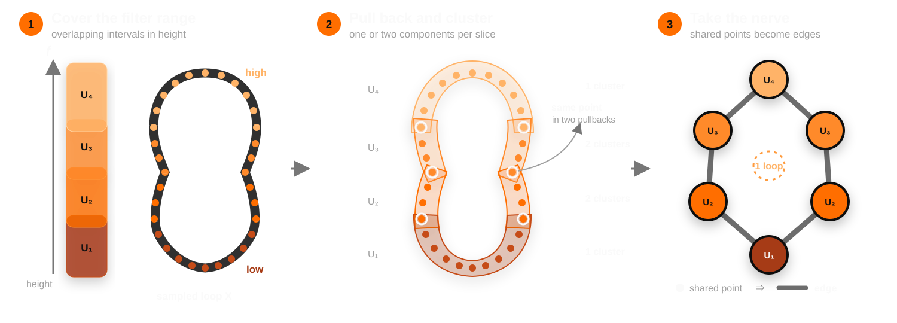
  <figcaption>Each cluster becomes a node. Two nodes are joined exactly when their clusters share a sampled point.</figcaption>
</figure>
```

<span class="citation">Construction after Singh–Mémoli–Carlsson, 2007</span>

::: {.notes}
Trace the same data from left to right. Emphasize that the white overlap points create the graph edges, while clustering replaces connected components.
:::

## A dictionary between worlds {data-breadcrumb="Mapper|Construction|Continuous → discrete"}

| Reeb (continuous) |  | Mapper (discrete) |
|---|:---:|---|
| topological space $X$ | ⟶ | finite metric space $(X,d)$ |
| $f:X\to\mathbb R$ | ⟶ | any filter on the sample |
| preimage of a point $c$ | ⟶ | preimage of an interval $U$ |
| connected components | ⟶ | clusters: DBSCAN, linkage, … |

::: {.formula-hero .fragment}
filter $f$ &nbsp; + &nbsp; cover $\mathcal U$ &nbsp; + &nbsp; clustering rule + nerve construction
:::

## The hinge: the nerve lemma {data-breadcrumb="Mapper|Construction|Nerve"}

> If a cover is **good**, meaning every nonempty finite intersection is contractible, its nerve is homotopy-equivalent to the union.

::: {.columns .v-center .gap-lg style="margin-top:.8em"}
::: {.column width="55%"}
Everything that follows is the nerve of a cover. **Only the cover changes.**

::: {.fragment}

- Mapper: nerve of a pullback cover.
- Ball Mapper: nerve of balls.
- Multiscale Mapper: tower of nerves.

:::
:::

::: {.column width="45%"}
<svg viewBox="0 0 480 330" style="width:100%;height:330px" aria-label="Three overlapping sets and their triangular nerve">
  <circle cx="175" cy="122" r="105" fill="#A63A14" opacity=".34" stroke="#A63A14" stroke-width="4"/>
  <circle cx="300" cy="122" r="105" fill="#FF6E00" opacity=".3" stroke="#FF6E00" stroke-width="4"/>
  <circle cx="238" cy="225" r="105" fill="#FF9B3D" opacity=".28" stroke="#FF9B3D" stroke-width="4"/>
  <g stroke="#FAFAFA" stroke-width="6"><line x1="175" y1="122" x2="300" y2="122"/><line x1="300" y1="122" x2="238" y2="225"/><line x1="238" y1="225" x2="175" y2="122"/></g>
  <g fill="#FAFAFA" stroke="#232323" stroke-width="4"><circle cx="175" cy="122" r="15"/><circle cx="300" cy="122" r="15"/><circle cx="238" cy="225" r="15"/></g>
</svg>
:::
:::

## The torus, now from a finite sample {data-breadcrumb="Mapper|Construction|Discrete Mapper" data-example="TORUS · FINITE SAMPLE"}

::: {.columns .v-center .gap-lg}
::: {.column width="48%"}
<div class="filter-panel compact">
<div class="eyebrow">4,000 points · projection onto x</div>

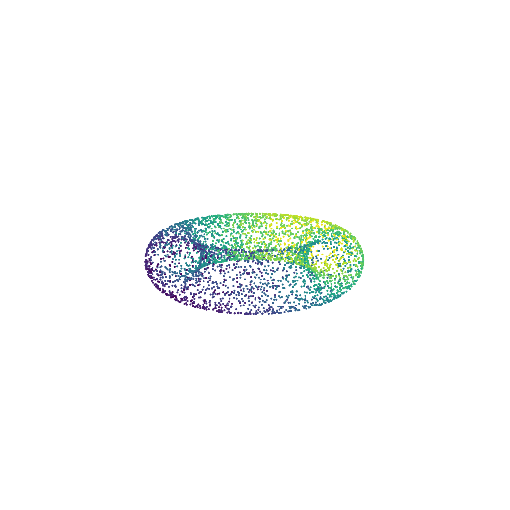{fig-alt="A sampled torus rotating slowly around the y-axis, coloured from purple to yellow by its x-coordinate"}

<div class="filter-formula">$f(x,y,z)=x$</div>
</div>
:::

::: {.column width="52%"}
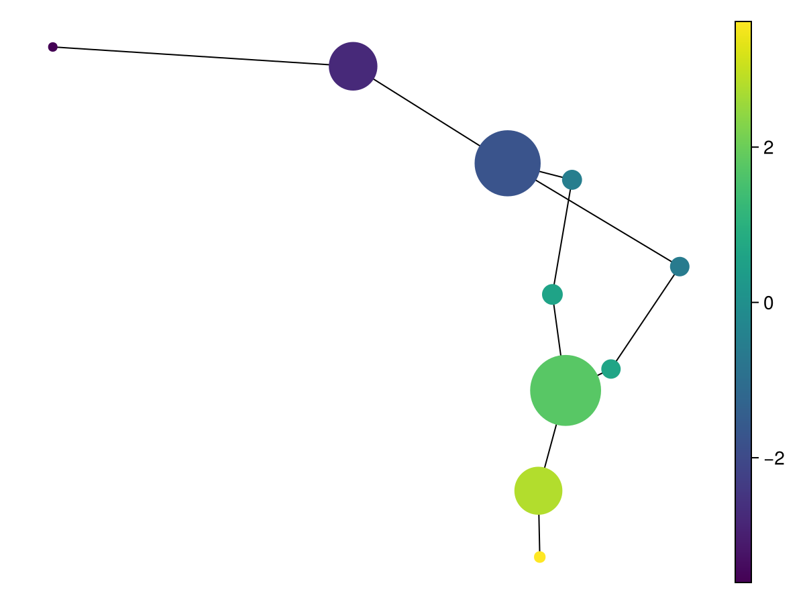{fig-alt="Mapper graph of a sampled torus, forming one cycle"}

::: {.callout-line}
**10 nodes · 10 edges · one loop · 2 tips.** Projection onto $x$ sees the loop between two tails.
:::
:::
:::

## One point cloud, different questions {data-breadcrumb="Mapper|Modelling choices|Filter" data-example="FLAMINGO · SAME SAMPLE"}

::: {.filter-comparison}
::: {.filter-panel .cloud}
<div class="eyebrow">FILTER 1 · HEIGHT</div>

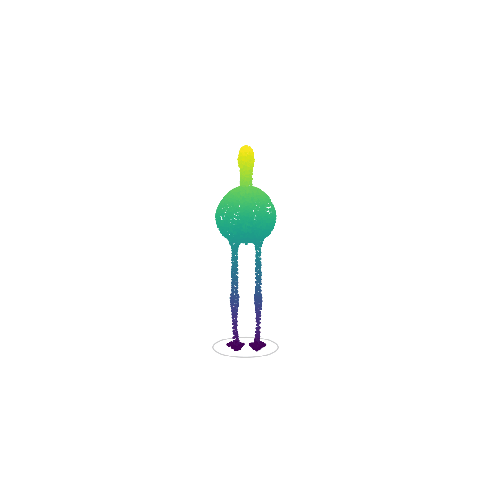{fig-alt="An upright flamingo point-cloud sample rotating slowly around the axis through its feet and coloured by height"}

<div class="filter-formula">$f_y(p)=y(p)$</div>
:::

::: {.filter-panel}
<div class="eyebrow">MAPPER</div>

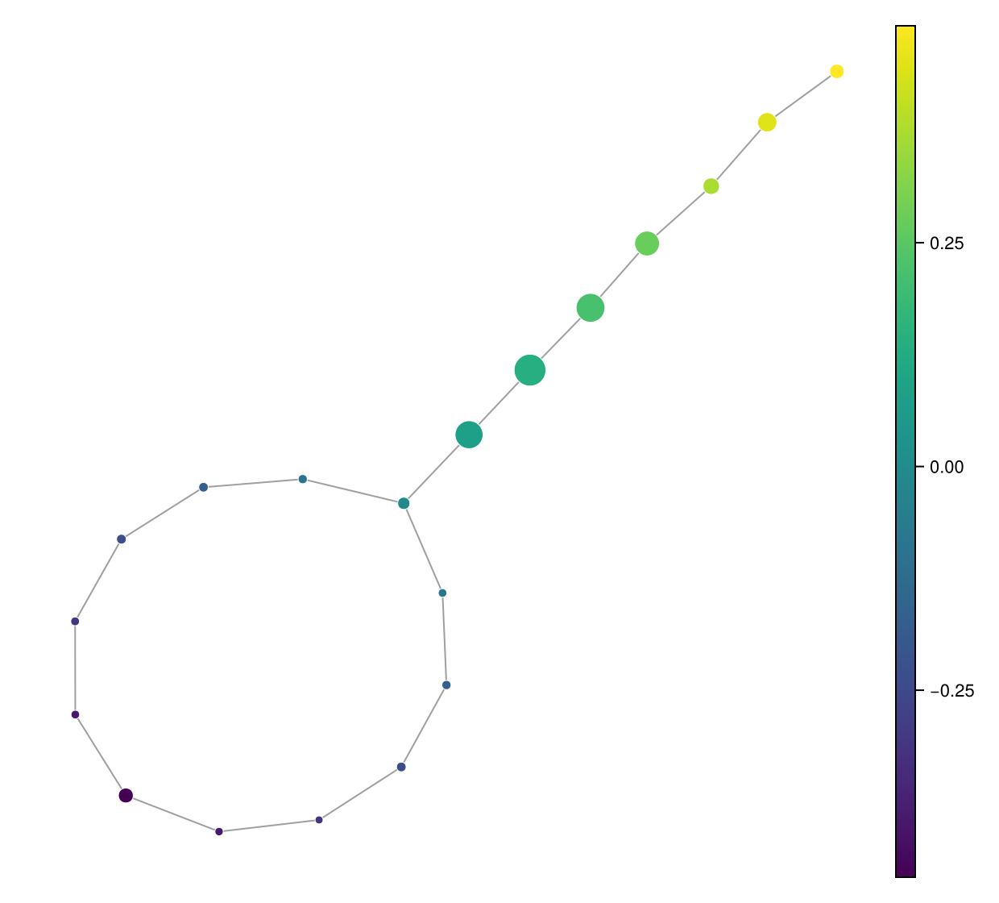{fig-alt="Mapper graph of the flamingo sample using height as the filter"}
:::
:::

::: {.callout-line}
Horizontal slices separate body parts that happen to share a height: **19 nodes · 19 edges · 1 component**.
:::

<div class="comparison-footer">Same 2,400 / 26,907-point sample · same cover · the geodesic panel also clusters with its intrinsic metric · <a href="https://github.com/vituri/mapperGUI/tree/master/examples">source</a></div>

::: {.notes}
The source cloud has 26,907 points; all four examples use the same deterministic farthest-point sample of 2,400. In the source coordinates y is the physical vertical axis. Height asks which parts of the animal occupy the same horizontal band.
:::

## A landmark turns the filter into a direction {data-breadcrumb="Mapper|Modelling choices|Filter" data-example="FLAMINGO · SAME SAMPLE"}

::: {.filter-comparison}
::: {.filter-panel .cloud}
<div class="eyebrow">FILTER 2 · DISTANCE FROM THE BEAK</div>

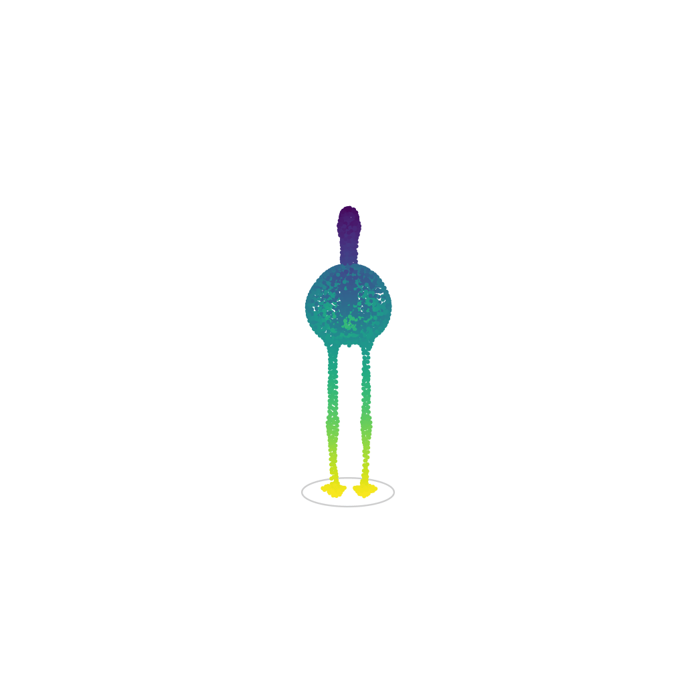{fig-alt="An upright flamingo point-cloud sample rotating slowly around the axis through its feet and coloured by distance from its beak"}

<div class="filter-formula">$f_b(p)=\lVert p-b\rVert$</div>
:::

::: {.filter-panel}
<div class="eyebrow">MAPPER</div>

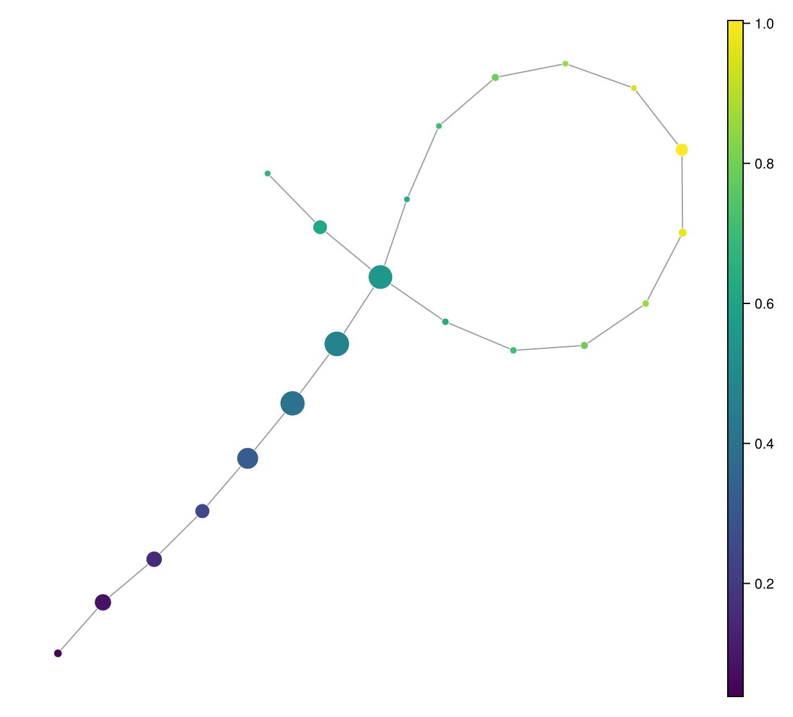{fig-alt="Mapper graph of the flamingo sample using distance from the beak as the filter"}
:::
:::

::: {.callout-line}
The beak supplies an origin, so the graph follows anatomical progress from head to feet: **21 nodes · 21 edges · 1 component**.
:::

<div class="comparison-footer">Same sample · same cover · same clustering · a different question</div>

::: {.notes}
The beak landmark is selected reproducibly as the extreme point on the flamingo's longitudinal axis. The lens now has semantic direction: distance travelled away from the head.
:::

## Eccentricity sees centre versus periphery {data-breadcrumb="Mapper|Modelling choices|Filter" data-example="FLAMINGO · SAME SAMPLE"}

::: {.filter-comparison}
::: {.filter-panel .cloud}
<div class="eyebrow">FILTER 3 · MEAN DISTANCE</div>

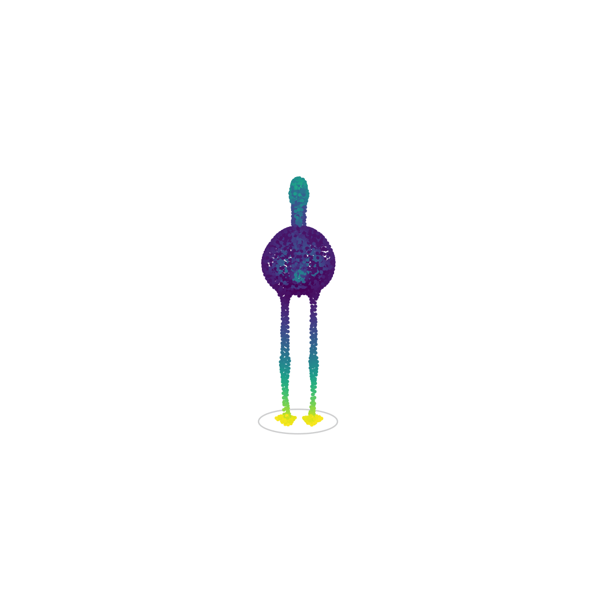{fig-alt="An upright flamingo point-cloud sample rotating slowly around the axis through its feet and coloured by mean distance to all sampled points"}

<div class="filter-formula">$f_{\mathrm{ecc}}(p)=\frac{1}{n}\sum_q d(p,q)$</div>
:::

::: {.filter-panel}
<div class="eyebrow">MAPPER</div>

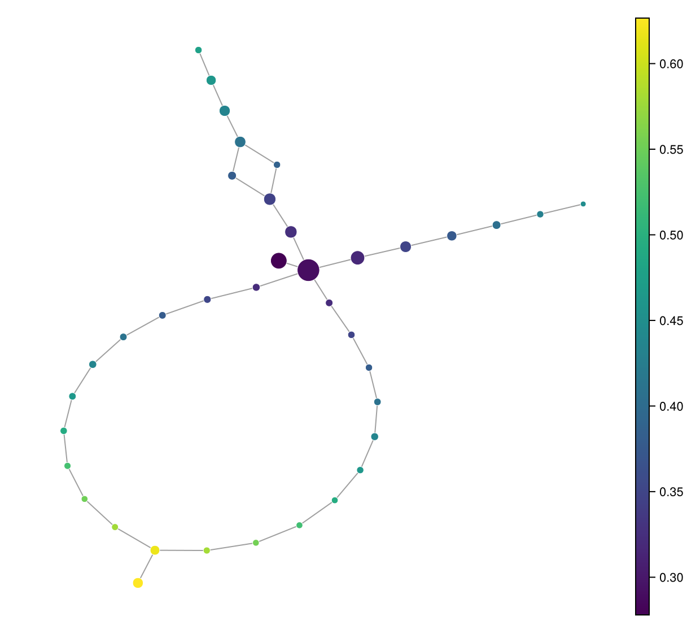{fig-alt="Mapper graph of the flamingo sample using eccentricity as the filter"}
:::
:::

::: {.callout-line}
Equal-distance shells mix remote body parts, then clustering splits them apart: **38 nodes · 39 edges · 1 component**.
:::

<div class="comparison-footer">The data did not change. The cover did not change. The topology of the summary did.</div>

::: {.notes}
Eccentricity is rotation-invariant, unlike height, but it groups points by centrality. The richer branching is partly authored by that choice; it is not an intrinsic picture of the flamingo independent of a lens.
:::

## Geodesic eccentricity follows the surface {data-breadcrumb="Mapper|Modelling choices|Filter + metric" data-example="FLAMINGO · SAME SAMPLE"}

::: {.filter-comparison}
::: {.filter-panel .cloud}
<div class="eyebrow">FILTER 4 · GEODESIC ECCENTRICITY</div>

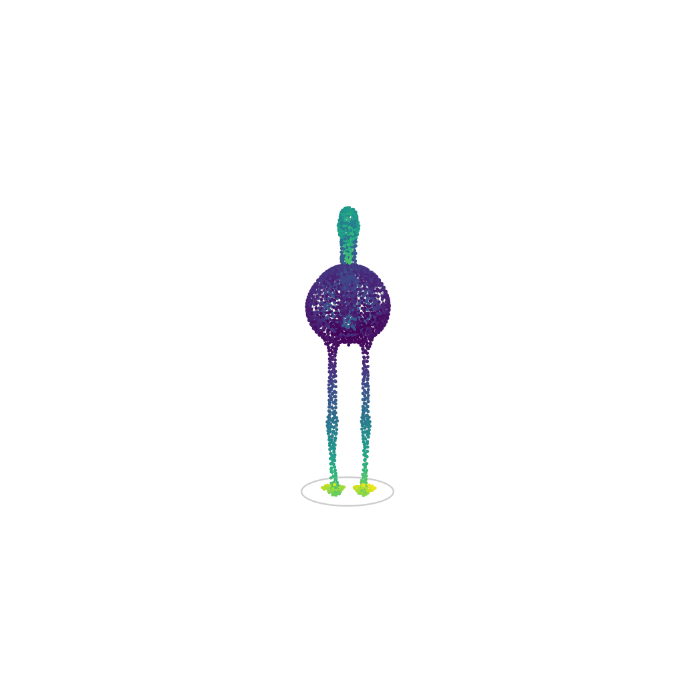{fig-alt="An upright rotating flamingo point cloud with all edges of its weighted 6-nearest-neighbour graph, coloured by mean geodesic distance to the full sample"}

<div class="filter-formula">$f_{\mathrm{ecc},G}(p)=\frac{1}{n}\sum_q d_G(p,q)$</div>
:::

::: {.filter-panel}
<div class="eyebrow">MAPPER</div>

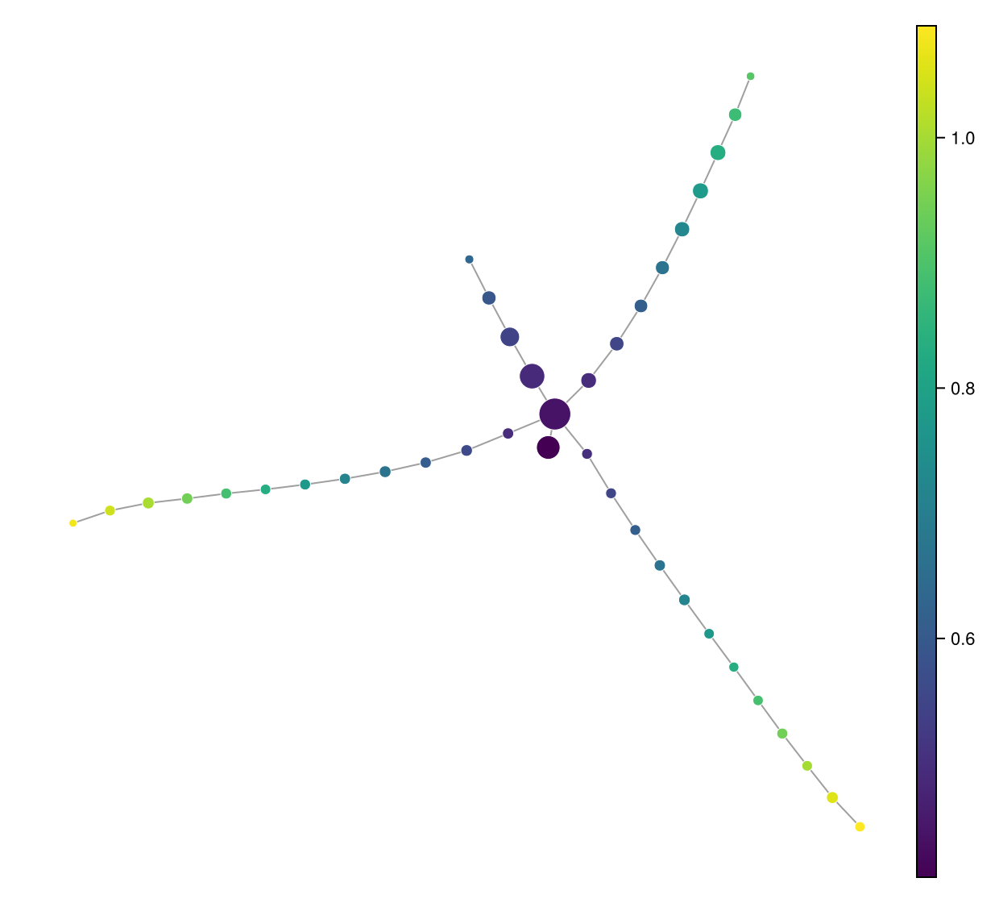{fig-alt="Mapper graph of the flamingo sample using eccentricity with weighted graph geodesic distance as the filter"}
:::
:::

::: {.callout-line}
The two foot flares now terminate separately: **0 mixed-foot nodes**. Their closest samples are **0.036 apart Euclidean but 1.564 geodesic (43×)**: **39 nodes · 38 edges · 1 component**.
:::

<div class="comparison-footer">3-NN graph · 4,321 edges · geodesic DBSCAN · 0 mixed-foot nodes</div>

::: {.notes}
Build the undirected 3-nearest-neighbour graph, weight every edge by Euclidean length, and run Dijkstra from every point. The filter value is each point's mean shortest-path distance to the full sample. The same distance matrix is used by DBSCAN inside each pullback-cover element; using an intrinsic lens with ambient Euclidean clustering would still glue the feet. The generator identifies the two feet geometrically and asserts both zero direct cross-foot graph edges and zero Mapper nodes containing points from both feet. All graph edges are drawn in the rotating panel.
:::

## When “statistical” is honest {data-breadcrumb="Mapper|Guarantees|Stability + inference"}

Mapper is deterministic once its parameters are fixed. Statistics enters in three different places.

::: {.card-grid style="margin-top:1em"}
::: {.card .fragment}
<span class="chip">sample</span>

Run on a sample, not on $X$ itself.
:::

::: {.card .fragment}
<span class="chip teal">converge</span>

Converges toward the Reeb graph as the sample grows.

<span class="citation">Munch–Wang, 2016</span>
:::

::: {.card .fragment}
<span class="chip green">infer</span>

Parameter selection and bootstrap uncertainty.

<span class="citation">Carrière–Michel–Oudot, 2018</span>
:::
:::

::: {.callout-line .fragment style="margin-top:1em"}
Structure and stability theory says small perturbations of the data move the 1-D Mapper only a little when the **cover is fixed**.
:::

## Two moves, many Mappers {data-breadcrumb="Mapper|Variants|Cover + nerve"}

::: {.card-grid .two}
::: {.card .tint-plum}
<div class="card-title">01 · Build a cover</div>

- cluster pullbacks of a filter;
- $\varepsilon$-balls around landmarks;
- adaptive balls;
- nearest-neighbour-scaled balls.
:::

::: {.card .tint-teal}
<div class="card-title">02 · Build a nerve</div>

- edge for any nonempty intersection;
- require at least $k$ shared points;
- threshold by overlap percentage;
- retain higher simplices or weights.
:::
:::

::: {.card-grid .four style="margin-top:.65em"}
<div class="card fragment"><span class="chip">multiscale</span><p class="small">A tower of covers and nerves.</p></div>
<div class="card fragment"><span class="chip teal">codomain</span><p class="small">Filters into $S^1$, graphs, or $\mathbb R^d$.</p></div>
<div class="card fragment"><span class="chip green">structure</span><p class="small">Stability via interleavings.</p></div>
<div class="card tint-yellow fragment"><span class="chip yellow">learn</span><p class="small">Optimise the filter itself.</p></div>
:::

## Differentiable Mapper learns the filter {data-breadcrumb="Mapper|Modelling choices|Learn the filter"}

::: {.columns .v-center .gap-lg}
::: {.column width="54%"}
<div class="eyebrow">Oulhaj · Carrière · Michel, ICML 2024</div>

**Reeb fixes** the filter. 

**Mapper chooses** it. 

Differentiable Mapper **learns** it.

::: {.fragment}

- smooth memberships approximate a hard cover;
- persistence values carry the gradient;
- `Zygote` + `Optimisers.Adam` update $\theta$;
- implemented in `TDAmapper.jl`.

:::

::: {.callout-line .fragment}
Extended persistence makes the objective loop-aware: ordinary $H_0$ sees branches, but a cycle can otherwise have zero loss and zero gradient.
:::
:::

::: {.column width="46%"}
```{=html}
<div class="differentiable-demo">
<svg viewBox="0 0 560 430" role="img" aria-label="A filter direction learning to align with a tent-shaped dataset">
  <path d="M90 340 L280 65 L470 340" fill="none" stroke="#FAFAFA" stroke-width="9" stroke-linecap="round" stroke-linejoin="round"/>
  <g fill="#FF9B3D"><circle cx="123" cy="292" r="9"/><circle cx="165" cy="231" r="9"/><circle cx="211" cy="166" r="9"/><circle cx="258" cy="99" r="9"/><circle cx="306" cy="103" r="9"/><circle cx="350" cy="166" r="9"/><circle cx="394" cy="230" r="9"/><circle cx="440" cy="296" r="9"/></g>
  <g class="filter-line"><line x1="280" y1="376" x2="280" y2="30" stroke="#FAFAFA" stroke-width="10" stroke-linecap="round"/><path d="M280 20l-18 31h36z" fill="#FAFAFA"/></g>
  <path d="M392 292 A140 140 0 0 0 378 117" fill="none" stroke="#FF6E00" stroke-width="7" stroke-dasharray="12 10"/>
  <text x="405" y="210" fill="#FF6E00" font-size="29" font-weight="700">∇θ</text>
</svg>
</div>
```
:::
:::

## When variance points the wrong way {data-breadcrumb="Mapper|Modelling choices|Learn the filter" data-example="TABLE · CONTROLLED BENCHMARK"}

<div class="eyebrow">Controlled benchmark · a table rotated isometrically into $\mathbb R^{10}$</div>

```{=html}
<div class="comparison-strip">
  <div>
    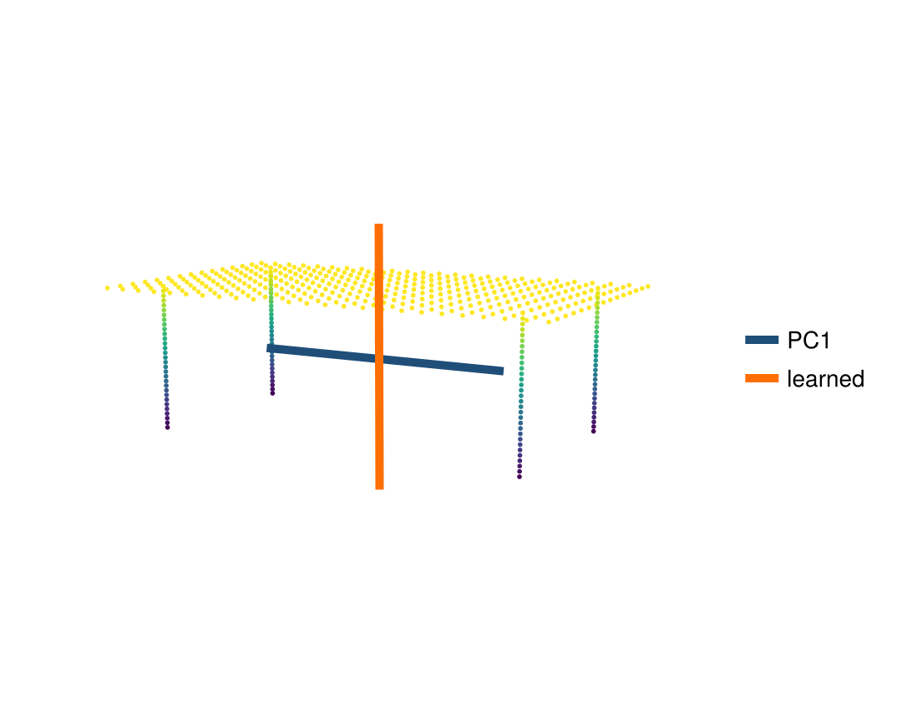
    <p class="small"><strong>Same geometry, hidden orientation.</strong><br>PC₁ follows the broad tabletop.</p>
  </div>
  <div>
    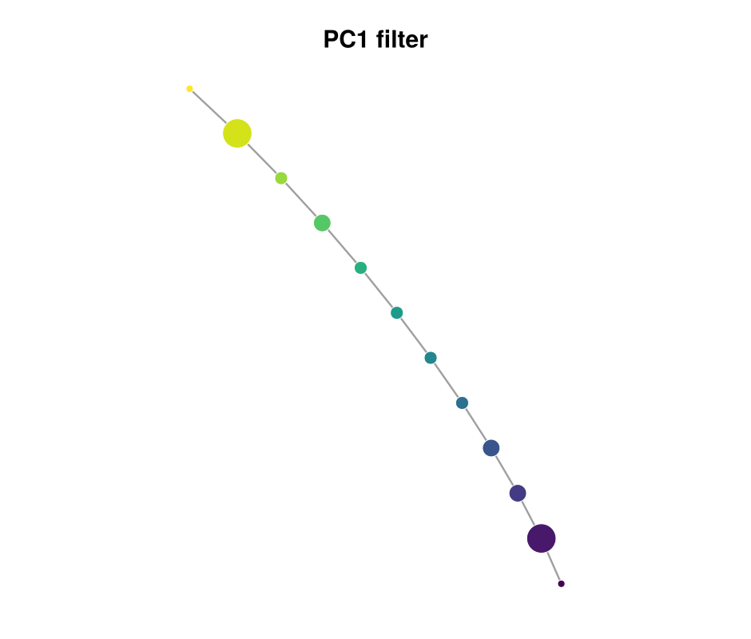
    <p class="small"><strong>PC₁:</strong> 12 nodes · 2 tips<br>ordinary H₀ persistence = 0</p>
  </div>
  <div>
    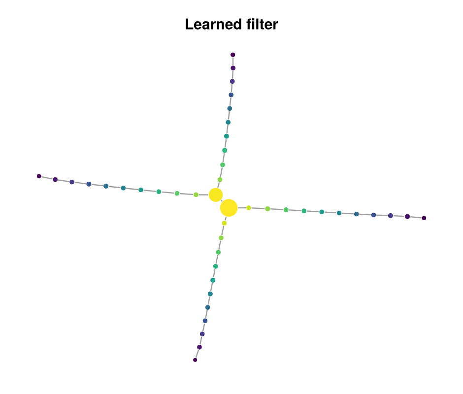
    <p class="small"><strong>Learned:</strong> 44 nodes · 4 tips<br>ordinary H₀ persistence = 4.40</p>
  </div>
</div>
```

::: {.callout-line style="margin-top:.35em"}
The learned direction recovers the hidden table normal: $|\cos(\theta,\theta^*)|=0.9999$, successful in **8 / 8** independent rotations. No part label enters the loss.
:::

::: {.notes}
The table is generated in three dimensions and embedded by a random semi-orthogonal matrix into ten dimensions, so all distances are preserved but no coordinate is privileged. The filter is normalized to prevent scale from gaming persistence. Four PCA-sign restarts are ranked only by the topological objective. PC1 sees variance along the tabletop; the learned direction exposes the four legs as persistent branches.
:::

## Mapper in the wild {.section-slide background-color="#1a1a1a" data-breadcrumb="Mapper|Landmark applications"}

<div class="eyebrow">Six published case studies · 2011–2017</div>

::: {.thesis}
The famous Mapper pictures did more than compress data.

They turned **branches, paths, and repeated shapes** into scientific hypotheses.
:::

<div class="application-years" aria-label="Years represented in the following case studies">
  <span>2011</span><span>2013</span><span>2015</span><span>2017</span>
</div>

::: {.notes}
This is a deliberately historical sequence. Each next slide uses an original figure from the cited paper and isolates the scientific claim that made the example memorable.
:::

## A branch became a breast-cancer subgroup {data-breadcrumb="Mapper|Landmark applications|Cancer genomics" data-example="BREAST CANCER · 2011"}

```{=html}
<div class="application-layout landscape">
  <figure class="paper-figure">
    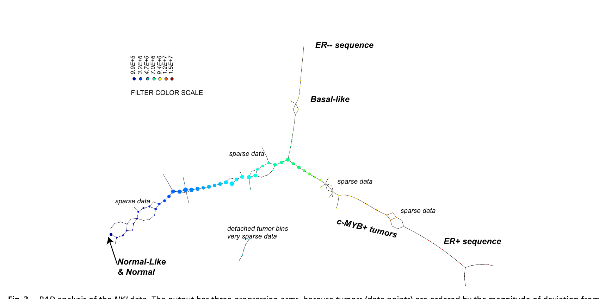
    <figcaption>Original Fig. 3 · NKI breast-tumor cohort</figcaption>
  </figure>
  <div class="paper-copy">
    <div class="paper-meta">Nicolau · Levine · Carlsson · PNAS · 2011</div>
    <p class="paper-question">Does gene expression vary through connected disease progressions rather than isolated clusters?</p>
    <div class="paper-finding">
      <span>The finding</span>
      <p>A dense <strong>c-MYB⁺, ER⁺/HER2⁻ arm</strong> emerged between sparse regions, an arrangement that ordinary clustering scattered across groups.</p>
    </div>
    <p class="paper-detail">The c-MYB⁺ group had 100% observed overall survival in the discovery cohort and a distinct molecular signature; the subgroup was then tested in an independent cohort.</p>
    <a class="paper-citation" href="https://doi.org/10.1073/pnas.1102826108">Nicolau et al., doi:10.1073/pnas.1102826108 · Fig. 3 ↗</a>
  </div>
</div>
```

::: {.notes}
The filter measures deviation from a healthy-state model: blue is close to normal and red is far from it. Emphasize the geometry, not only the colors. The c-MYB-positive tumors form a dense segment of the ER-positive arm bracketed by sparse regions. Survival was not used to construct this graph; it was examined after the subgroup was found.
:::

## The same survivor arm appeared twice {data-breadcrumb="Mapper|Landmark applications|Cancer replication" data-example="BREAST CANCER · 2013"}

```{=html}
<div class="application-layout landscape">
  <figure class="paper-figure">
    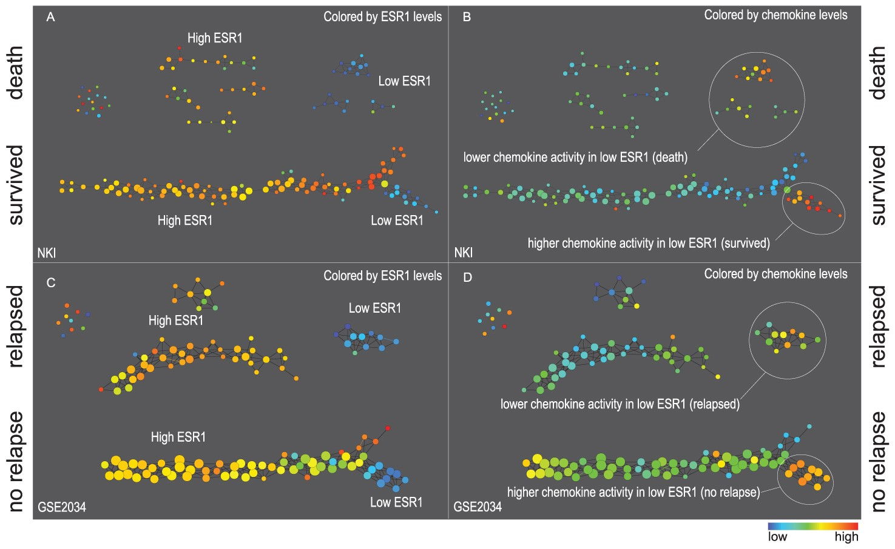
    <figcaption>Original Fig. 2 · two cohorts, two molecular colorings</figcaption>
  </figure>
  <div class="paper-copy">
    <div class="paper-meta">Lum et al. · Scientific Reports · 2013</div>
    <p class="paper-question">Can a topological patient subgroup recur across different microarray platforms?</p>
    <div class="paper-finding">
      <span>The finding</span>
      <p>Both cohorts contained a comparable <strong>Y-shaped survivor / non-relapse structure</strong> with a low-ESR1 arm.</p>
    </div>
    <p class="paper-detail">That unusual low-ESR1, good-outcome arm also showed elevated chemokine-pathway expression, turning visual correspondence into a biological lead.</p>
    <a class="paper-citation" href="https://doi.org/10.1038/srep01236">Lum et al., doi:10.1038/srep01236 · Fig. 2 ↗</a>
  </div>
</div>
```

::: {.notes}
Panels A and B use the NKI cohort; C and D use GSE2034. The top components are death or relapse and the lower Y-shaped components are survival or no relapse. The network used outcome as one filter, so describe this as supervised stratification and cross-cohort correspondence, not as an outcome-blind discovery.
:::

## Five basketball positions became thirteen roles {data-breadcrumb="Mapper|Landmark applications|Sports analytics" data-example="NBA · 2010–11"}

```{=html}
<div class="application-layout landscape">
  <figure class="paper-figure">
    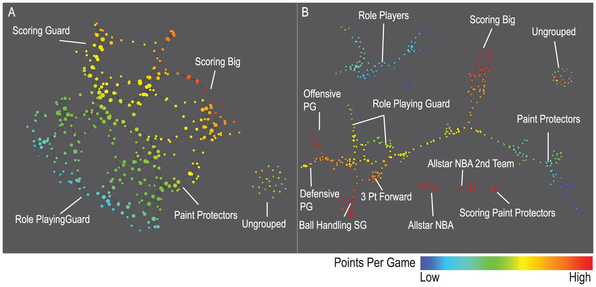
    <figcaption>Original Fig. 5 · low resolution left, high resolution right</figcaption>
  </figure>
  <div class="paper-copy">
    <div class="paper-meta">Alagappan 2012 · Lum et al. 2013</div>
    <p class="paper-question">What if a player's position is inferred from performance, not height or a roster label?</p>
    <div class="paper-finding">
      <span>The finding</span>
      <p>Seven per-minute statistics for 452 players yielded <strong>thirteen connected playing styles</strong>, not the traditional five positions.</p>
    </div>
    <p class="paper-detail">Offensive and defensive point guards separated; “paint protectors,” scoring bigs, and small elite-player islands became visible.</p>
    <a class="paper-citation" href="https://doi.org/10.1038/srep01236">Lum et al., doi:10.1038/srep01236 · Fig. 5 ↗</a>
  </div>
</div>
```

::: {.notes}
This is the historical bridge to the football study. The network uses points, rebounds, assists, turnovers, steals, blocks, and fouls per minute. The two panels also make multiresolution concrete: a coarser cover shows broad groups, while a finer cover reveals the thirteen-role vocabulary popularized by Alagappan's Sloan presentation.
:::

## Type-2 diabetes became three patient profiles {data-breadcrumb="Mapper|Landmark applications|Precision medicine" data-example="T2D · 11,210 PATIENTS"}

```{=html}
<div class="application-layout portrait">
  <figure class="paper-figure">
    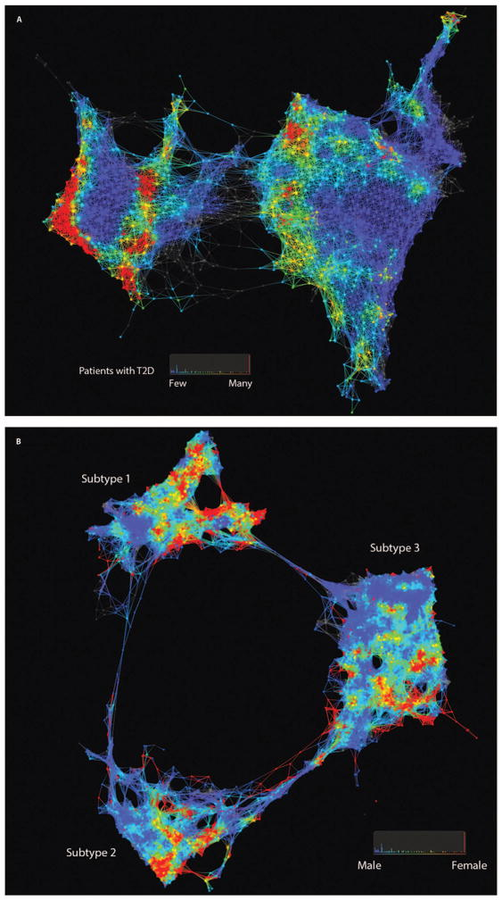
    <figcaption>Original Fig. 1 · all patients above, T2D subtypes below</figcaption>
  </figure>
  <div class="paper-copy">
    <div class="paper-meta">Li et al. · Science Translational Medicine · 2015</div>
    <p class="paper-question">Can one diagnosis hide several clinically and genetically distinct populations?</p>
    <div class="paper-finding">
      <span>The finding</span>
      <p>Among 2,551 people with T2D, Mapper separated <strong>three patient subtypes</strong> with different comorbidity patterns.</p>
    </div>
    <p class="paper-detail">Subtype 1 emphasized nephropathy / retinopathy; subtype 2 cancer / cardiovascular disease; subtype 3 cardiovascular / neurological disease and other conditions. Genotypes, which were not used to build the graph, showed subtype-specific associations.</p>
    <a class="paper-citation" href="https://doi.org/10.1126/scitranslmed.aaa9364">Li et al., doi:10.1126/scitranslmed.aaa9364 · Fig. 1 ↗</a>
  </div>
</div>
```

::: {.notes}
The full network used more than 500 EMR-derived variables for 11,210 patients. The lower network isolates the T2D population. The strongest validation move is independence: genotype data did not determine the topology, yet subtype-specific variants and pathways aligned with the clinical differences. Present these as study-defined subtypes, not today's clinical standard of care.
:::

## A 20-year-old trial contained a hidden predictor {data-breadcrumb="Mapper|Landmark applications|Neurotrauma" data-example="SPINAL CORD INJURY · 2015"}

```{=html}
<div class="application-layout landscape">
  <figure class="paper-figure">
    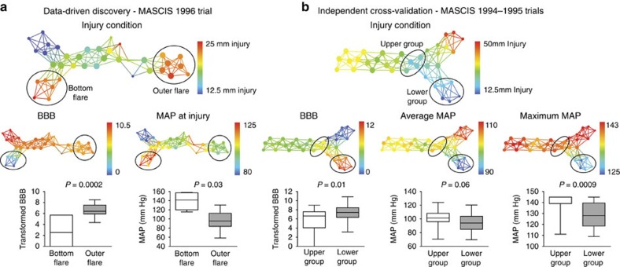
    <figcaption>Original Fig. 5 · discovery cohort left, validation cohort right</figcaption>
  </figure>
  <div class="paper-copy">
    <div class="paper-meta">Nielson et al. · Nature Communications · 2015</div>
    <p class="paper-question">Can connected outcome profiles reveal a factor that conventional trial summaries missed?</p>
    <div class="paper-finding">
      <span>The finding</span>
      <p>Within matched spinal-cord injuries, the poor-recovery branch was associated with <strong>perioperative hypertension</strong>.</p>
    </div>
    <p class="paper-detail">The relationship was recovered in a separate cohort from the same historical trial, then tested explicitly with conventional statistics.</p>
    <a class="paper-citation" href="https://doi.org/10.1038/ncomms9581">Nielson et al., doi:10.1038/ncomms9581 · Fig. 5 ↗</a>
  </div>
</div>
```

::: {.notes}
The Mapper graph guided the authors to subjects with the same targeted injury but very different locomotor recovery. A variable query implicated spikes in mean arterial pressure. They then cross-validated in a separate 1994–1995 cohort and followed with formal hypothesis testing. This is a useful example of Mapper as a hypothesis generator embedded in a validation workflow.
:::

## Cell fate became a branching trajectory {data-breadcrumb="Mapper|Landmark applications|Single-cell biology" data-example="scRNA-SEQ · 2017"}

```{=html}
<div class="application-layout balanced">
  <figure class="paper-figure">
    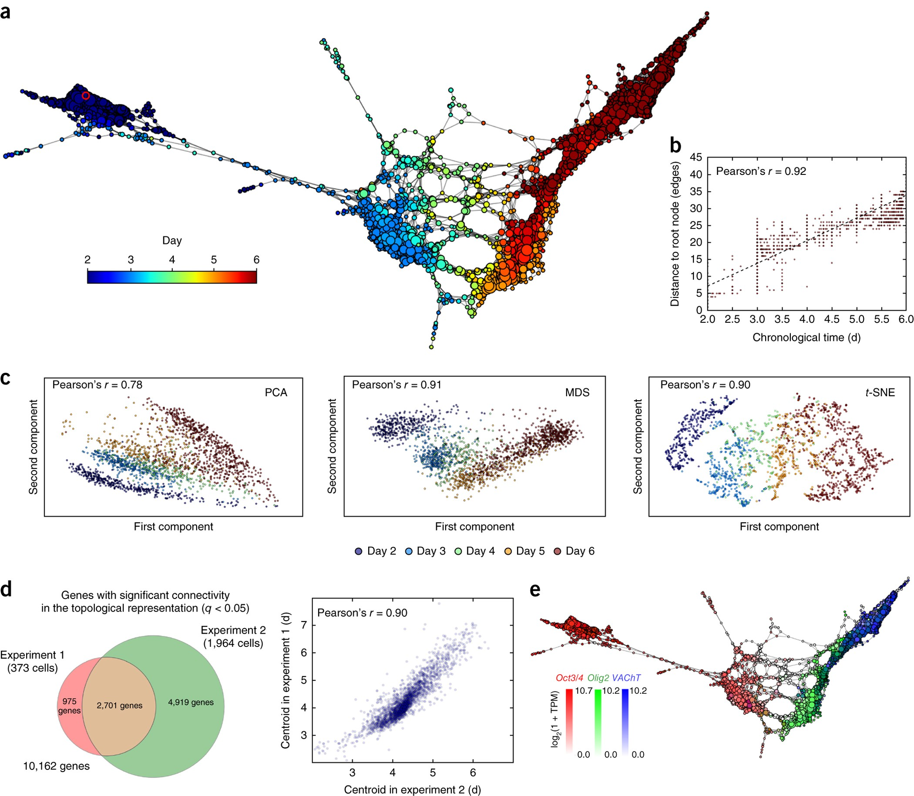
    <figcaption>Original Fig. 3 · motor-neuron differentiation</figcaption>
  </figure>
  <div class="paper-copy">
    <div class="paper-meta">Rizvi et al. · Nature Biotechnology · 2017</div>
    <p class="paper-question">How do asynchronously differentiating cells move through transient states?</p>
    <div class="paper-finding">
      <span>The finding</span>
      <p>scTDA recovered a continuous developmental path with <strong>four transient identities</strong>: pluripotent, precursor, progenitor, and differentiated.</p>
    </div>
    <p class="paper-detail">Recoloring the same topology by day and marker expression aligned transcriptional progression with experimentally observed motor-neuron development.</p>
    <a class="paper-citation" href="https://doi.org/10.1038/nbt.3854">Rizvi et al., doi:10.1038/nbt.3854 · Fig. 3 ↗</a>
  </div>
</div>
```

::: {.notes}
The graph is colored first by collection day, then by selected transcripts. The main point is that experiment time and cellular state do not coincide perfectly: asynchronous cells overlap across days, while Mapper preserves the continuity and branching of the transcriptional process.
:::

## The branches carry the story {.section-slide background-color="#1a1a1a" data-breadcrumb="Mapper|Case study" data-example="FOOTBALL"}

<div class="eyebrow">From theorem to exploration</div>

::: {.notes}
This is the tonal shift. The audience now has the construction and its caveats; move quickly into the football example.
:::

## The data: each player is a performance profile {data-breadcrumb="Mapper|Case study|Data" data-example="FOOTBALL · 1,513 PLAYERS"}

<div class="eyebrow">FBref-derived snapshot · 2020–21</div>

::: {.columns .top .gap-lg}
::: {.column width="35%"}
::: {.card .tint-teal}
<span class="big-number">1,513</span>
outfield players from the five major European leagues.
:::

::: {.card .tint-yellow style="margin-top:.55em"}
<span class="big-number">900+</span>
minutes played: enough exposure for per-90 rates to be meaningful.
:::

<p class="tiny muted" style="margin-top:1em">Source: FBref-derived public mirror by <code>eddwebster/football_analytics</code>. Goalkeepers and incomplete rows are removed.</p>
:::

::: {.column width="65%"}
::: {.card}
<div class="card-title">18 z-scored metrics define the point cloud</div>

<span class="chip teal">ATTACK</span>
goals · shots · shots on target · xG · assists · xA

<span class="chip green">ON THE BALL</span>
pass completion · key passes · passes into the box · progressive passes · touches · carries · progressive carries

<span class="chip yellow">DEFENCE</span>
tackles · interceptions · blocks · clearances

<p class="small muted">plus a non-penalty goals + assists rate</p>
:::

::: {.callout-line .fragment style="margin-top:.65em"}
Player, team, nationality, and position are kept only for interpretation. **Mapper sees none of those labels.**
:::
:::
:::

::: {.notes}
Each row is a player and each metric is standardized across this cohort. Per-90 rates reduce the effect of playing time; the 900-minute floor limits small-sample extremes. The labels are joined back only after the graph has been constructed.
:::

## Why Mapper, not another scatter? {data-breadcrumb="Mapper|Case study|Why a graph?" data-example="FOOTBALL · SAME DATA"}

::: {.columns .v-center .gap-lg}
::: {.column width="52%"}
<div class="image-stage">
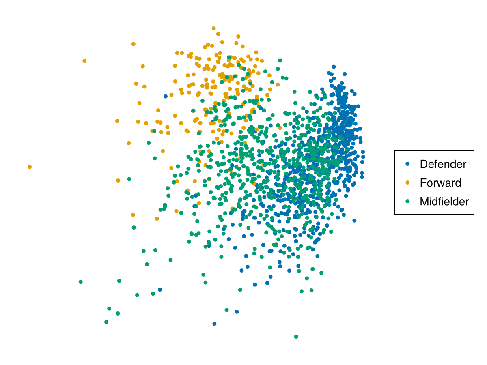{fig-alt="PCA scatter plot of football players"}
</div>
:::

::: {.column width="48%"}
PCA and UMAP compress overlapping styles into a cloud.

Mapper retains **local continuity**, then turns changes in that continuity into branches.

::: {.fragment}

The published examples used the same visual grammar:

**interesting populations occupy branches, transitions, and repeated shapes, not only isolated clusters.**

:::

<span class="citation">Here, every node remains linked to the original players and every edge records shared membership.</span>
:::
:::

## Football has a shape {data-breadcrumb="Mapper|Case study|Baseline Mapper" data-example="FOOTBALL · SAME DATA"}

::: {.columns .v-center .gap-lg}
::: {.column width="36%"}
<span class="big-number">1,513</span>
outfield players from the five major European leagues, 2020–21.

<span class="big-number" style="margin-top:.45em">18</span>
z-scored per-90 features.

<span class="big-number" style="margin-top:.45em">0</span>
position labels shown to Mapper.

<p class="small muted">Filter: PC₁ · 14 intervals · DBSCAN inside each slice</p>
:::

::: {.column width="64%"}
<div class="image-stage tall">
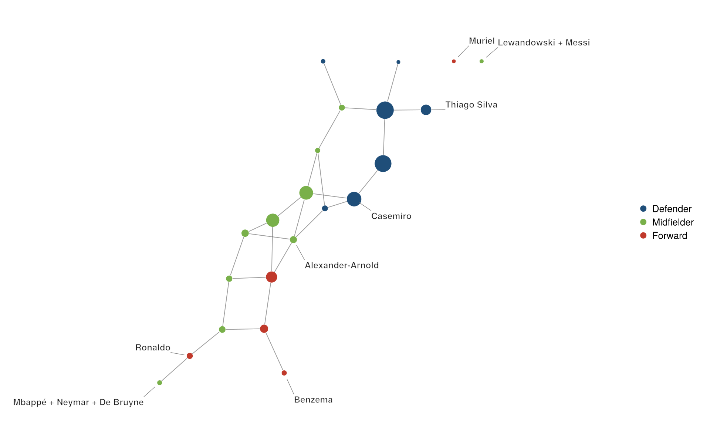{fig-alt="Football Mapper graph with named specialist players"}
</div>
:::
:::

::: {.notes}
Point to the defensive chain, midfield connection, attacking region, and then the specialist tips. Mention the 0.67 node purity versus 0.463 baseline only verbally if time allows.
:::

## Who does Mapper call similar? {data-breadcrumb="Mapper|Case study|Player neighbourhoods" data-example="FOOTBALL · SAME NODE"}

```{=html}
<div class="interactive-shell" data-demo="buttons">
  <div class="control-row" role="group" aria-label="Choose which football Mapper nodes to label with example players">
    <button class="active" data-src="figures/soccer_players_attack.png" data-caption="<strong>Attacking end · nodes 1–8:</strong> Messi + Lewandowski; Mbappé + Neymar + De Bruyne; Benzema + Salah; plus five more neighbourhoods.">Attack</button>
    <button data-src="figures/soccer_players_midfield.png" data-caption="<strong>Middle · nodes 9–17:</strong> Kimmich + Gündoğan; Modrić + Pogba; Casemiro + De Jong; plus six more.">Middle</button>
    <button data-src="figures/soccer_players_defense.png" data-caption="<strong>Defensive end · nodes 18–22:</strong> Kanté + Busquets + Ramos; Marquinhos + Varane + Bonucci; Thiago Silva + Rúben Dias + Koulibaly.">Defence</button>
  </div>
  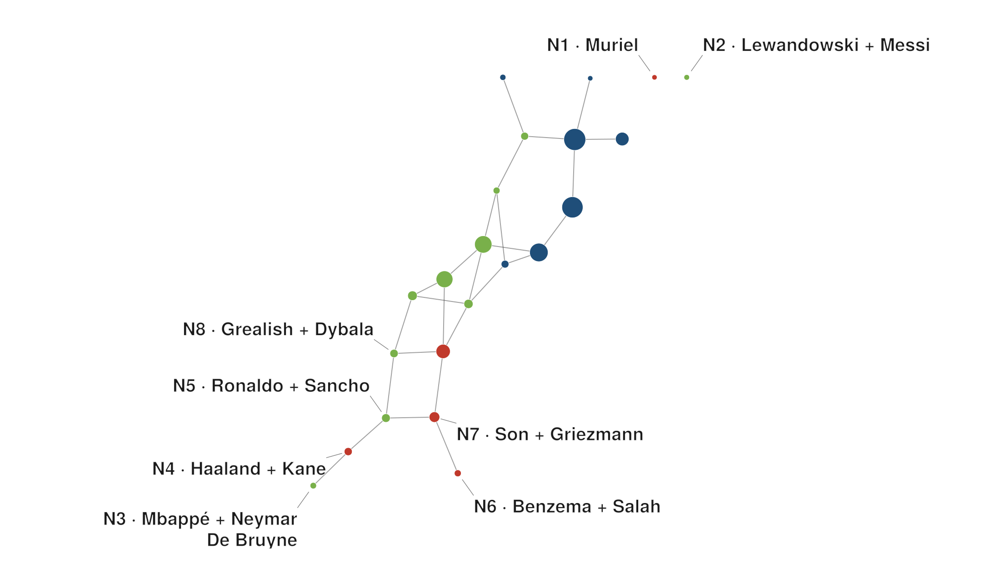
  <div class="demo-caption" data-demo-caption><strong>Attacking end · nodes 1–8:</strong> Messi + Lewandowski; Mbappé + Neymar + De Bruyne; Benzema + Salah; plus five more neighbourhoods.</div>
</div>
```

::: {.notes}
The names on one label really occur in the same Mapper node: they are close in the 18 standardized per-90 metrics and lie in the same PC1 cover slice. This is local, lens-dependent similarity, not a claim that the players are interchangeable. Because the cover overlaps, a player may appear in two adjacent nodes; those shared players are exactly what create the edges. Use the three buttons to cover all 22 nodes without turning the graph into a wall of text.
:::

## One graph, many stories {data-breadcrumb="Mapper|Case study|Interpretation" data-example="FOOTBALL · SAME GRAPH"}

```{=html}
<div class="interactive-shell" data-demo="buttons">
  <div class="control-row" role="group" aria-label="Choose how to colour the football Mapper graph">
    <button class="active" data-src="figures/soccer_goals.png" data-caption="<strong>Goals:</strong> the attacking end lights up.">Goals</button>
    <button data-src="figures/soccer_defense.png" data-caption="<strong>Defending:</strong> almost the mirror image of goals.">Defending</button>
    <button data-src="figures/soccer_playmaking.png" data-caption="<strong>Playmaking:</strong> mostly flat along PC₁, then it spikes on a side branch, revealing structure the filter did not encode.">Playmaking</button>
    <button data-src="figures/soccer_brazil.png" data-caption="<strong>Brazil:</strong> no Brazilian cluster; named players occupy both extremes and the middle.">Brazil</button>
  </div>
  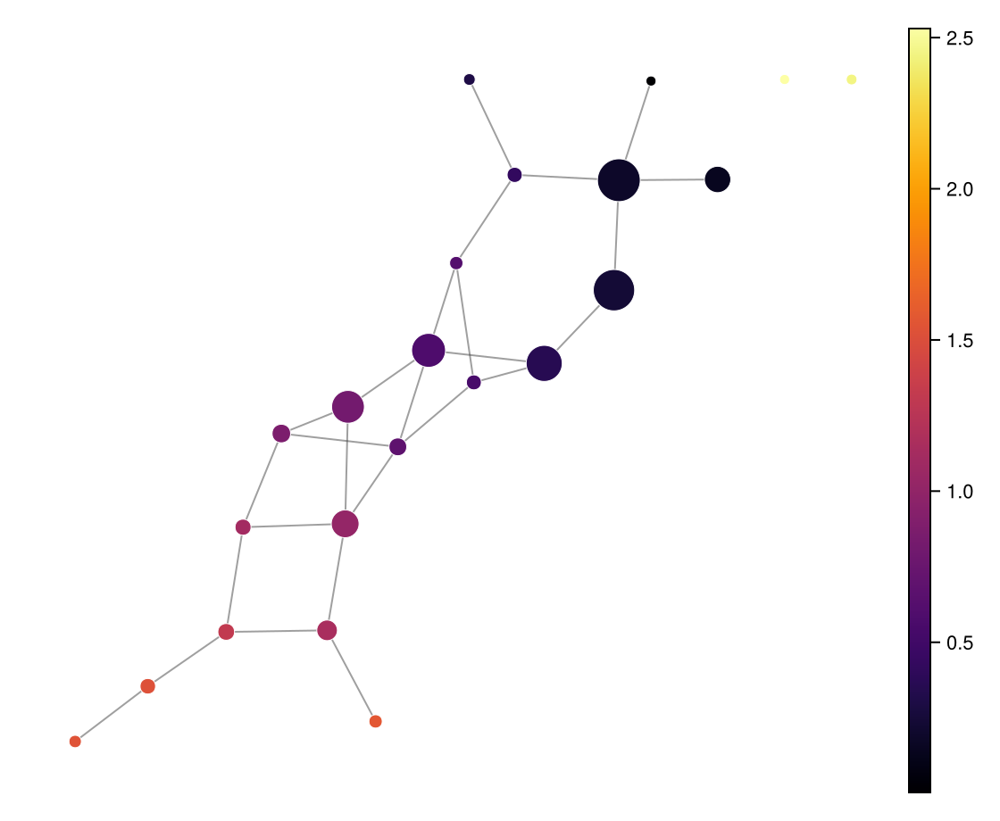
  <div class="demo-caption" data-demo-caption><strong>Goals:</strong> the attacking end lights up.</div>
</div>
```

::: {.notes}
This is the central audience-facing interaction. Recolour without changing the node positions. Pause on playmaking: its tip is off-filter structure that a PC1 scatter flattens away.
:::

## Change the filter, change the question {data-breadcrumb="Mapper|Modelling choices|Filter" data-example="FOOTBALL · SAME DATA"}

```{=html}
<div class="interactive-shell" data-demo="buttons">
  <div class="control-row" role="group" aria-label="Choose a filter for the football Mapper graph">
    <button class="active" data-src="figures/filter_pc1.png" data-caption="<strong>PC₁:</strong> 49 nodes · 68 edges · 6 components · 12 tips.">PC₁</button>
    <button data-src="figures/filter_learned.png" data-caption="<strong>Learned:</strong> 55 nodes · 73 edges · 6 components · 19 tips; branch objective +59%.">Learned</button>
    <button data-src="figures/filter_attack.png" data-caption="<strong>xG + xA:</strong> the same 49 nodes, but 76 edges · 3 components · 8 tips.">xG + xA</button>
    <button data-src="figures/filter_ecc.png" data-caption="<strong>Eccentricity:</strong> radial shells manufacture flares in many directions · 26 tips.">Eccentricity</button>
    <button data-src="figures/filter_dens.png" data-caption="<strong>kNN density fails here:</strong> 1,113 players collapse into a single node.">kNN density</button>
  </div>
  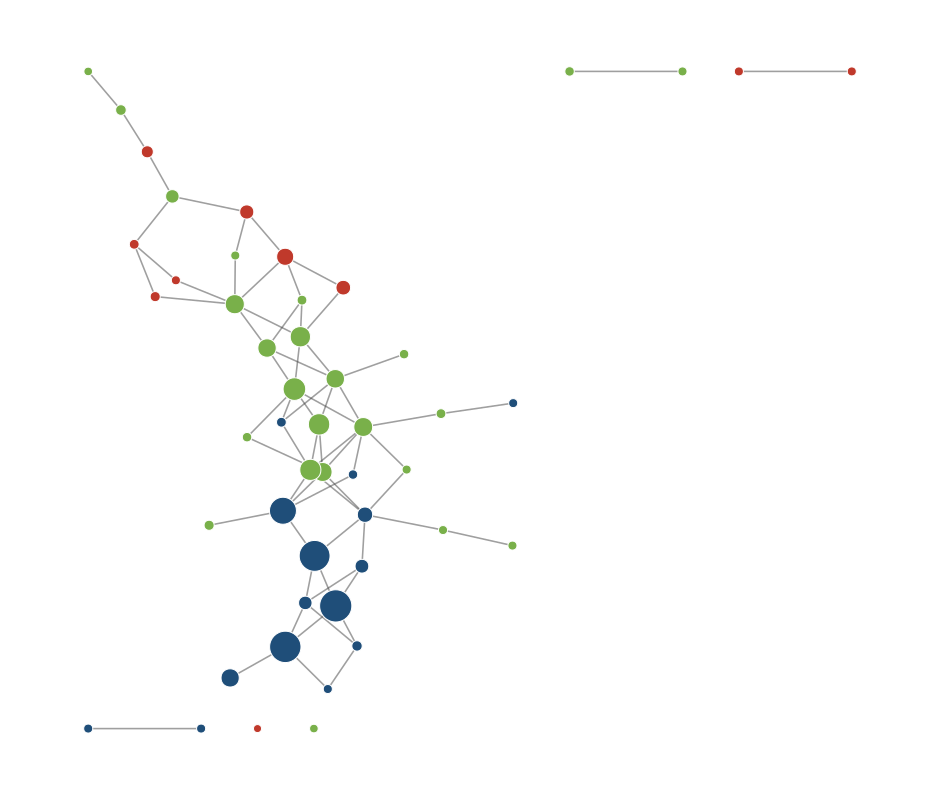
  <div class="demo-caption" data-demo-caption><strong>PC₁:</strong> 49 nodes · 68 edges · 6 components · 12 tips.</div>
</div>
```

::: {.callout-line style="margin-top:.35em"}
Same data. Same cover. Same clustering. The **filter** is doing the work.
:::

## The football lens learns, literally {data-breadcrumb="Mapper|Modelling choices|Filter" data-example="FOOTBALL · SAME DATA"}

::: {.filter-comparison .learned-compact}
::: {.filter-panel}
<div class="eyebrow">PC₁</div>

{fig-alt="Football Mapper graph built with the first principal component"}

<span class="filter-formula">branch score 8.13</span>
:::

::: {.filter-panel}
<div class="eyebrow">Gradient-optimised linear filter</div>

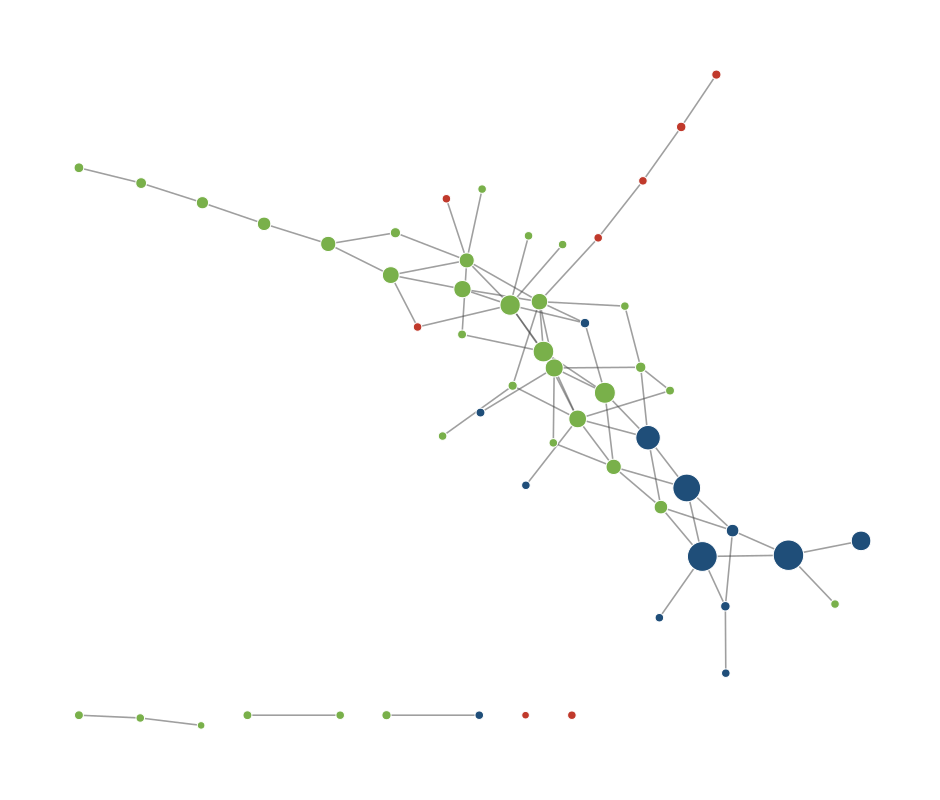{fig-alt="Football Mapper graph built with the learned linear filter"}

<span class="filter-formula">branch score 12.97 · +59%</span>
:::
:::

::: {.card-grid .two style="margin-top:.35em"}
::: {.card .tint-teal}
<div class="card-title">What improved</div>

Ordinary branch persistence: **1.15 → 2.61**. Mean node position purity: **0.738 → 0.770**.
:::

::: {.card .tint-yellow}
<div class="card-title">What did not</div>

Point-weighted purity stays flat: **0.650 → 0.646**. More topology is not automatically more meaning.
:::
:::

::: {.notes}
All 18 features enter the linear family; output values are standardized inside the differentiable filter so variance or parameter scale cannot win by itself. Optimization starts from PC1 and retains the best label-free topological checkpoint. Position labels are joined only afterward. The gain is real for the requested branch objective, but the held-out evaluation warns against calling any topological objective semantic truth.
:::

## The pullback still needs clustering {data-breadcrumb="Mapper|Modelling choices|Clustering" data-example="FOOTBALL · SAME DATA"}

For every cover element $U_i$, Mapper must split the pullback $f^{-1}(U_i)$ into clusters.
Those clusters, rather than the intervals, become nodes.

::: {.card-grid .four style="margin-top:.7em"}
::: {.card}
<span class="chip">none</span>

**Trivial:** one cluster per nonempty pullback. Fast, but disconnected pieces can be merged.
:::

::: {.card}
<span class="chip teal">density</span>

**DBSCAN:** variable cluster count and non-convex shapes. Radius and density thresholds matter.
:::

::: {.card}
<span class="chip green">linkage</span>

**Single linkage / first empty bin:** cut a dendrogram. Adaptive, but sensitive to chaining.
:::

::: {.card}
<span class="chip yellow">partition</span>

**$k$-means / $k$-medoids:** request $k$ groups per pullback. Simple, but can force a split.
:::
:::

::: {.callout-line .fragment style="margin-top:.7em"}
Clustering changes the **nodes themselves**. There is no universally neutral refiner.
:::

## Same pullback, different answers {data-breadcrumb="Mapper|Modelling choices|Clustering" data-example="NOISY TWO MOONS · SAME DATA"}

<div class="image-stage" style="height:560px; margin-top:.1em">
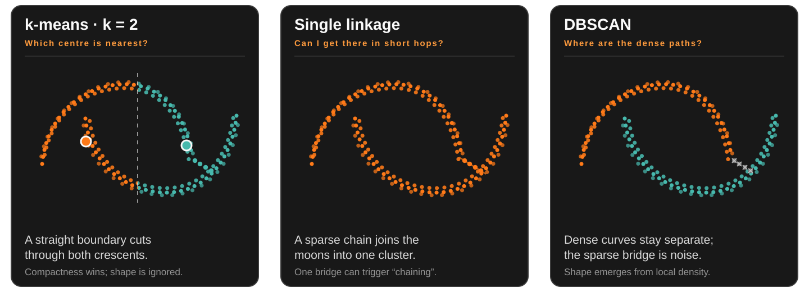{fig-alt="Three clustering methods applied to the same noisy two-moons point cloud with a sparse bridge: k-means cuts across the moons, single linkage chains them together, and DBSCAN separates the dense curves while treating the bridge as noise"}
</div>

::: {.callout-line style="margin-top:.25em"}
Same points. Different definitions of **“together.”** The refiner turns that definition into Mapper nodes.
:::

::: {.notes}
This is the classical two-moons benchmark with a deliberately sparse bridge. K-means asks for two compact Voronoi cells, so its boundary cuts across the non-convex moons. Single linkage only needs a chain of sufficiently short pairwise distances; the bridge can therefore merge both moons. DBSCAN requires density-connected core points, so the sparse bridge can be rejected as noise while the two curved dense regions remain separate. The precise answer of every method still depends on its parameters; the point of the slide is the geometric bias each parameter controls.
:::

## Same lens, different clustering {data-breadcrumb="Mapper|Modelling choices|Clustering" data-example="FOOTBALL · SAME DATA"}

```{=html}
<div class="interactive-shell" data-demo="buttons">
  <div class="control-row" role="group" aria-label="Choose the clustering algorithm used inside each pullback">
    <button class="active" data-src="figures/cluster_firstempty.png" data-caption="<strong>First empty bin:</strong> an adaptive single-linkage cut · 20 nodes · 16 edges · 4 components.">First empty bin</button>
    <button data-src="figures/cluster_dbscan.png" data-caption="<strong>DBSCAN:</strong> local density separates branches · 49 nodes · 68 edges · cycle rank 25.">DBSCAN</button>
    <button data-src="figures/cluster_kmeans.png" data-caption="<strong>k-means, k = 2:</strong> a split is requested in every nonempty slice · 35 nodes · 37 edges · cycle rank 7.">k-means</button>
  </div>
  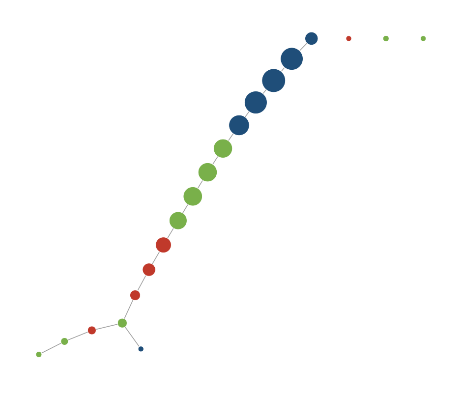
  <div class="demo-caption" data-demo-caption><strong>First empty bin:</strong> an adaptive single-linkage cut · 20 nodes · 16 edges · 4 components.</div>
</div>
```

::: {.callout-line style="margin-top:.35em"}
Same PC₁ filter. Same 20 intervals. Same overlap. The **refiner** decides whether a slice stays whole or branches.
:::

## From intervals to rectangles {data-breadcrumb="Mapper|Modelling choices|2-D filter + cover" data-example="FOOTBALL · SAME DATA"}

When $f:X\to\mathbb R^2$, write $f(x)=(f_1(x),f_2(x))$ and cover the image with overlapping rectangles.

::: {.card-grid style="margin-top:.75em"}
::: {.card .tint-plum}
<div class="card-title">01 · two coordinates</div>

$f(x)=\big(\mathrm{PC}_1(x),\mathrm{PC}_2(x)\big)$

The lens retains two directions instead of ordering every point on one line.
:::

::: {.card .tint-teal}
<div class="card-title">02 · grid cover</div>

$\mathcal U=\{I_i\times J_j\}$

Each observation may lie in several horizontal, vertical, or diagonal neighbours.
:::

::: {.card .tint-yellow}
<div class="card-title">03 · pull back + nerve</div>

Cluster every $f^{-1}(I_i\times J_j)$, then connect clusters that share observations.
:::
:::

::: {.formula-hero .fragment style="margin-top:.65em"}
$\text{path-like layering in }\mathbb R \quad\longrightarrow\quad \text{grid-like adjacency in }\mathbb R^2$
:::

::: {.notes}
This is not a 2-D graph: the graph is still the one-skeleton of the pullback nerve. It is the image of the filter, and therefore the cover, that is two-dimensional. Compared with R1, R2 adds a second resolution and overlap parameter and usually produces a denser graph.
:::

## Two lenses reveal what one cannot {data-breadcrumb="Mapper|Modelling choices|2-D filter + cover" data-example="FOOTBALL · SAME DATA"}

::: {.columns .v-center .gap-lg}
::: {.column width="63%"}
<div class="image-stage tall">
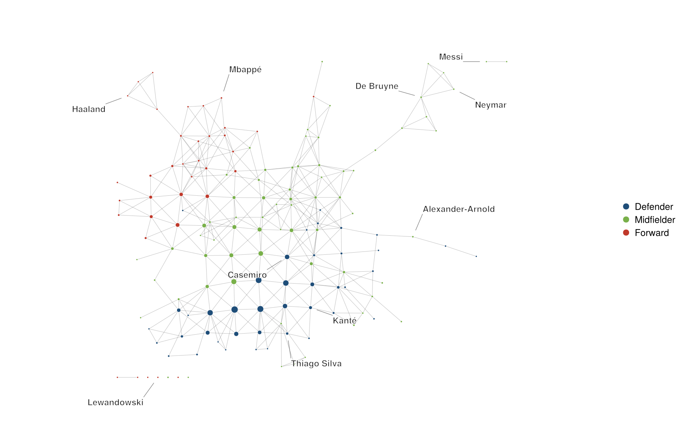{fig-alt="Two-dimensional football Mapper graph using the first two principal components"}
</div>
:::

::: {.column width="37%"}
`R2Cover(PC₁, PC₂)` uses a $12\times12$ grid.

<span class="big-number">146</span> nodes

<span class="big-number">390</span> edges

<span class="big-number">252</span> cycle rank

::: {.fragment}

A one-dimensional filter with expansion $<1$ maps every node to a slice on a **path**. Its Mapper graph must be bipartite and triangle-free.

A grid maps to the king graph on $\mathbb Z^2$. Triangles become possible: this graph has **322**.

:::
:::
:::

## Overlap has a phase change {data-breadcrumb="Mapper|Modelling choices|Cover overlap" data-example="FOOTBALL · SAME DATA"}

```{=html}
<div class="interactive-shell" data-demo="range" data-frames='[
  {"src":"figures/overlap_04.png","label":"e = 0.4","caption":"<strong>29 edges · cycle rank 7 · 0 triangles.</strong> A layered, Reeb-like graph."},
  {"src":"figures/overlap_10.png","label":"e = 1.0","caption":"<strong>37 edges · cycle rank 10 · 0 triangles.</strong> The boundary: second-neighbour slices touch only at endpoints."},
  {"src":"figures/overlap_14.png","label":"e = 1.4","caption":"<strong>74 edges · cycle rank 43 · 47 triangles.</strong> Edges now jump over adjacent level sets."}
]'>
  <div class="range-control">
    <span>layered</span>
    <input type="range" min="0" max="2" value="0" step="1" aria-label="Select interval overlap">
    <span class="range-readout" data-range-readout></span>
  </div>
  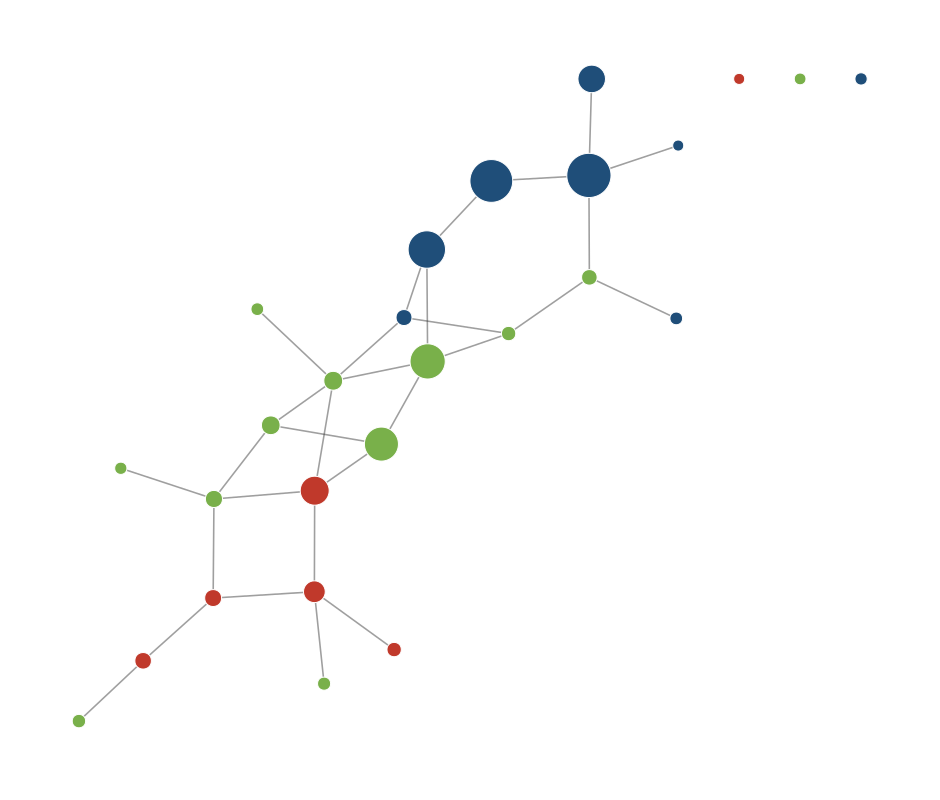
  <div class="demo-caption" data-demo-caption></div>
</div>
```

::: {.callout-line style="margin-top:.35em"}
At <span class="threshold">$e>1$</span>, non-adjacent slices overlap. The loops we would measure can become artefacts of the cover.
:::

## Four ways to decide whether an edge is real {data-breadcrumb="Mapper|Modelling choices|Nerve rule" data-example="FOOTBALL · SAME DATA"}

Let $A$ and $B$ be two Mapper nodes: clusters of observations from overlapping pullbacks.

::: {.card-grid .four style="margin-top:.7em"}
::: {.card}
<span class="chip">simple</span>

$|A\cap B|\ge 1$

One shared observation is enough. This is the ordinary nerve.
:::

::: {.card}
<span class="chip teal">minimum count</span>

$|A\cap B|\ge 2$

Reject edges supported by a single observation.
:::

::: {.card}
<span class="chip green">percentage</span>

$\dfrac{|A\cap B|}{\min(|A|,|B|)}\ge .2$

The overlap must explain 20% of at least one cluster.
:::

::: {.card}
<span class="chip yellow">Jaccard</span>

$\dfrac{|A\cap B|}{|A\cup B|}\ge .1$

Normalise by the combined size of both clusters.
:::
:::

::: {.callout-line .fragment style="margin-top:.7em"}
Count thresholds are scale-dependent; relative thresholds compare unequal node sizes more fairly.
:::

## The nerve is a modelling choice too {data-breadcrumb="Mapper|Modelling choices|Nerve rule" data-example="FOOTBALL · SAME CLUSTERS"}

```{=html}
<div class="interactive-shell" data-demo="buttons">
  <div class="control-row" role="group" aria-label="Choose the nerve rule">
    <button class="active" data-src="figures/nerve_simple.png" data-caption="<strong>Simple nerve:</strong> one shared player creates an edge · 390 edges · 8 components · cycle rank 252.">Any overlap</button>
    <button data-src="figures/nerve_min2.png" data-caption="<strong>At least 2 shared players:</strong> 210 edges · 48 components · cycle rank 112.">Count ≥ 2</button>
    <button data-src="figures/nerve_percentage.png" data-caption="<strong>At least 20% of either cluster:</strong> 303 edges · 8 components · cycle rank 165.">Share ≥ 20%</button>
    <button data-src="figures/nerve_jaccard.png" data-caption="<strong>Jaccard ≥ 0.1:</strong> 213 edges · 18 components · cycle rank 85.">Jaccard ≥ 0.1</button>
  </div>
  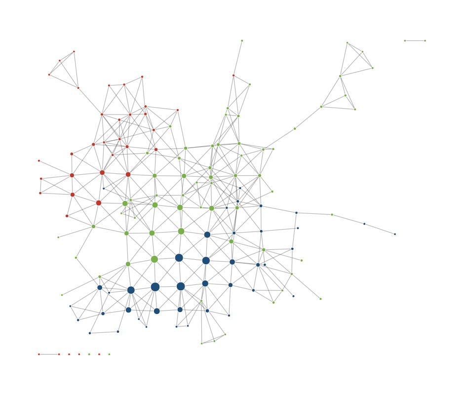
  <div class="demo-caption" data-demo-caption><strong>Simple nerve:</strong> one shared player creates an edge · 390 edges · 8 components · cycle rank 252.</div>
</div>
```

::: {.callout-line style="margin-top:.35em"}
Same 146 clusters. Same purity. Only the definition of an **edge** changed. Once thresholded, this is no longer the ordinary nerve, so the nerve lemma does not transfer automatically.
:::

## Does the story survive resolution? {data-breadcrumb="Mapper|Robustness check|Cover resolution" data-example="FOOTBALL · SAME DATA"}

```{=html}
<div class="interactive-shell" data-demo="range" data-frames='[
  {"src":"figures/soccer_coarse.png","label":"coarse · 12 nodes","caption":"Branches vanish into a defender–midfielder–forward path."},
  {"src":"figures/soccer_position.png","label":"as read · 22 nodes","caption":"The presentation resolution: roles remain ordered and specialist tips appear."},
  {"src":"figures/soccer_fine.png","label":"fine · 45 nodes","caption":"The graph fragments into five components. More detail is not automatically more truth."}
]'>
  <div class="range-control">
    <span>coarse</span>
    <input type="range" min="0" max="2" value="1" step="1" aria-label="Select Mapper resolution">
    <span class="range-readout" data-range-readout></span>
  </div>
  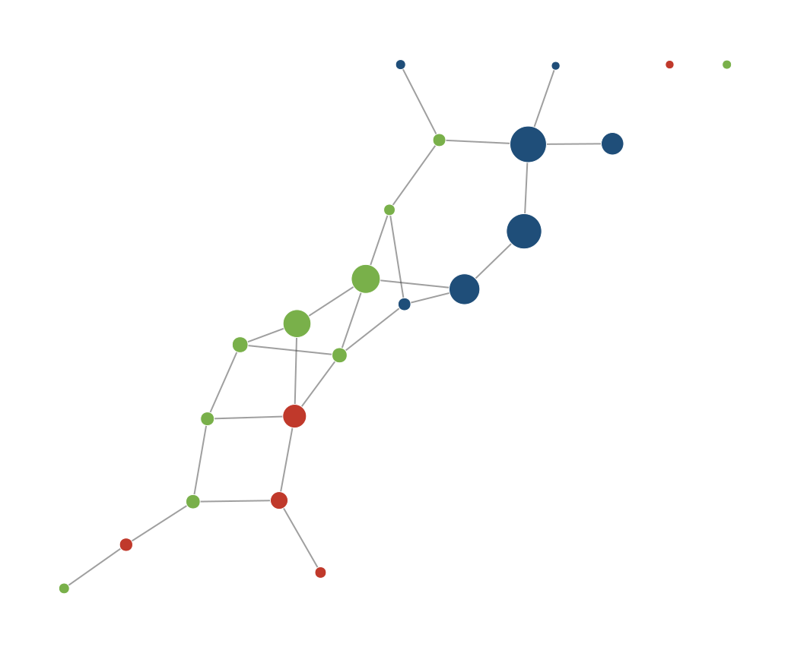
  <div class="demo-caption" data-demo-caption></div>
</div>
```

::: {.callout-line style="margin-top:.35em"}
The **ordering of roles is stable**. The branch structure is not. Stability theory holds the cover fixed; choosing the cover remains the open problem.
:::

# Another kind of Mapper

## Ball Mapper covers the data directly {.ball-mapper-slide data-breadcrumb="Mapper|Variant|Ball Mapper" data-example="TOY LOOP"}

<div class="ball-mapper-explainer">
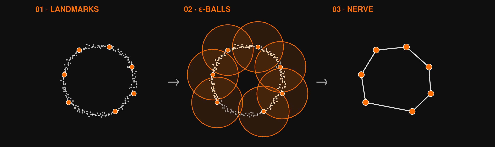{fig-alt="A Julia-generated Ball Mapper construction: a circular point cloud with seven farthest-point landmarks, epsilon balls around them, and the resulting seven-node nerve cycle"}
</div>

::: {.card-grid .ball-mapper-cards style="margin-top:.15em"}
::: {.card .tint-plum}
<div class="card-title">01 · landmarks</div>

Choose $L\subset X$, often by greedy farthest-point sampling, so landmarks spread across the data.
:::

::: {.card .tint-teal}
<div class="card-title">02 · balls</div>

$A_\ell=\{x\in X:d(x,\ell)\le\varepsilon\}$

One node represents each nonempty landmark ball.
:::

::: {.card .tint-yellow}
<div class="card-title">03 · nerve</div>

$A_\ell\sim A_m\iff A_\ell\cap A_m\ne\varnothing$

An edge requires a **shared observation**, not merely intersecting geometric balls.
:::
:::

::: {.callout-line .fragment style="margin-top:.4em"}
There is no filter and no within-slice clustering, but the metric, landmarks, radius, and nerve rule still encode modelling choices.
:::

::: {.notes}
The landmark balls cover observations, not the unknown ambient space. Ball Mapper is especially attractive when no meaningful scalar lens is available. Node size counts covered observations; node colour can aggregate any auxiliary variable just as in classical Mapper.
:::

## Ball Mapper: no filter, one unforgiving scale {data-breadcrumb="Mapper|Variant|Ball Mapper radius" data-example="FOOTBALL · SAME DATA"}

```{=html}
<div class="interactive-shell" data-demo="buttons">
  <div class="control-row" role="group" aria-label="Choose the Ball Mapper radius">
    <button class="active" data-src="figures/ball_30.png" data-caption="<strong>ε = 3.0:</strong> dust · 39 components · 36 isolated landmarks.">ε = 3.0</button>
    <button data-src="figures/ball_36.png" data-caption="<strong>ε = 3.6:</strong> hairball · 760 edges · cycle rank 673.">ε = 3.6</button>
  </div>
  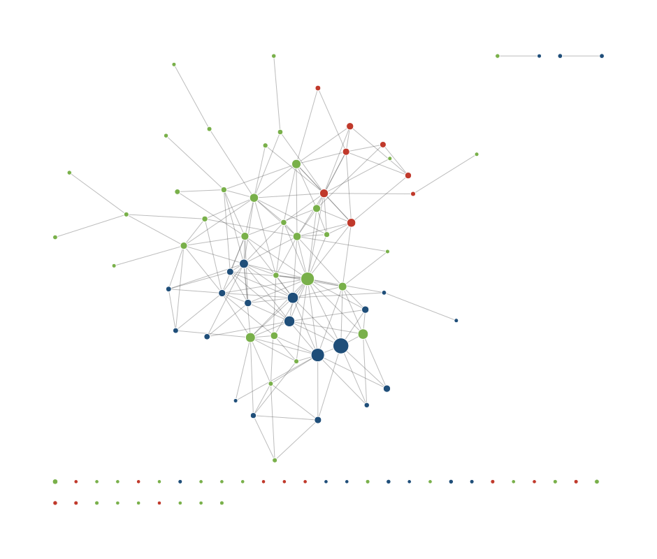
  <div class="demo-caption" data-demo-caption><strong>ε = 3.0:</strong> dust · 39 components · 36 isolated landmarks.</div>
</div>
```

::: {.callout-line style="margin-top:.35em"}
In 18 dimensions, distances concentrate. Ball Mapper removes the filter, but its one remaining knob must carry all the weight.
:::

## What the experiment taught us {data-breadcrumb="Mapper|Case study|What survived?" data-example="FOOTBALL · SYNTHESIS"}

::: {.card-grid .two style="margin-top:.8em"}
::: {.card .tint-teal .fragment}
### Structure that survived

The broad ordering from defending through midfield to attack persists across resolutions and recolourings.
:::

::: {.card .tint-red .fragment}
### Structure that did not

Individual branches, loops, and components can change sharply with cover, overlap, lens dimension, and nerve rule.
:::
:::

::: {.formula-hero .fragment}
The picture is an argument, never the conclusion.
:::

## Open problems · open stack {data-breadcrumb="Mapper|Outlook|Open questions"}

::: {.columns .top .gap-lg}
::: {.column width="52%"}
::: {.card}
<div class="card-title">Open problems</div>

- nonlinear trainable filters;
- principled, data-driven cover selection;
- uncertainty that includes modelling choices, not only perturbations at a fixed cover;
- loop-aware differentiable objectives at scale.
:::
:::

::: {.column width="48%"}
::: {.card .tint-teal}
<div class="card-title">JuliaTDA</div>

`TDAmapper.jl`  
`MetricSpaces.jl`  
`TDAplots.jl`  
`Ripserer.jl`  
`PersistenceInference.jl`

**Fast · composable · native autodiff**

[github.com/JuliaTDA](https://github.com/JuliaTDA)
:::
:::
:::

## Long story short {.section-slide background-color="#1a1a1a" data-breadcrumb="Mapper|Takeaway"}

::: {.closing-line}
Reeb **fixes** the filter · Mapper **chooses** it · Differentiable Mapper **learns** it.

<br>

<span class="yellow">And throughout: everything is the nerve of a cover.</span>

<br>

<span class="yellow">And flamingos.</span>
:::

## References · origins and applications {data-breadcrumb="Mapper|References|Applications"}

::: {.small}
- Reeb, G. (1946). *Sur les points singuliers d'une forme de Pfaff…* C. R. Acad. Sci. Paris **222**, 847–849.
- Singh, G., Mémoli, F., Carlsson, G. (2007). [*Topological Methods for the Analysis of High-Dimensional Data Sets and 3D Object Recognition.*](https://diglib.eg.org/items/82993db7-17e9-4d7d-b1c3-04e0c05162d2) PBG@Eurographics.
- Yao, Y. et al. (2009). [*Topological methods for exploring low-density states in biomolecular folding pathways.*](https://doi.org/10.1063/1.3103496) J. Chem. Phys. **130**, 144115.
- Nicolau, M., Levine, A. J., Carlsson, G. (2011). [*Topology based data analysis identifies a subgroup of breast cancers with a unique mutational profile and excellent survival.*](https://doi.org/10.1073/pnas.1102826108) PNAS **108**, 7265–7270.
- Alagappan, M. (2012). [*From 5 to 13: Redefining the Positions in Basketball.*](https://www.sloansportsconference.com/research-papers/from-5-to-13-redefining-the-positions-in-basketball) MIT Sloan Sports Analytics Conference.
- Lum, P. et al. (2013). [*Extracting insights from the shape of complex data using topology.*](https://doi.org/10.1038/srep01236) Scientific Reports **3**, 1236.
- Li, L. et al. (2015). [*Identification of type 2 diabetes subgroups through topological analysis of patient similarity.*](https://doi.org/10.1126/scitranslmed.aaa9364) Sci. Transl. Med. **7**, 311ra174.
- Nielson, J. L. et al. (2015). [*Topological data analysis for discovery in preclinical spinal cord injury and traumatic brain injury.*](https://doi.org/10.1038/ncomms9581) Nature Communications **6**, 8581.
- Rizvi, A. H. et al. (2017). [*Single-cell topological RNA-seq analysis reveals insights into cellular differentiation and development.*](https://doi.org/10.1038/nbt.3854) Nature Biotechnology **35**, 551–560.
:::

## References · theory and variants {data-breadcrumb="Mapper|References|Theory"}

::: {.small}
- Munch, E., Wang, B. (2016). *Convergence between categorical representations of Reeb space and Mapper.* SoCG.
- Dey, T., Mémoli, F., Wang, Y. (2016). *Multiscale Mapper.* SODA.
- Carrière, M., Oudot, S. (2018). *Structure and Stability of the One-Dimensional Mapper.* FoCM **18**, 1333–1396.
- Carrière, M., Michel, B., Oudot, S. (2018). *Statistical Analysis and Parameter Selection for Mapper.* JMLR.
- Oulhaj, Z., Carrière, M., Michel, B. (2024). *Differentiable Mapper for Topological Optimization of Data Representation.* ICML.
- Dłotko, P. (2019). *Ball mapper: a shape summary for topological data analysis.* arXiv:1901.07410.
:::

## Obrigado! {.section-slide background-color="#1a1a1a" data-breadcrumb="Mapper|End"}

::: {.closing-line}
**Guilherme Vituri**

Symbolic Mind · JuliaTDA

<span class="yellow">viturivituri&#64;gmail.com</span>
:::
